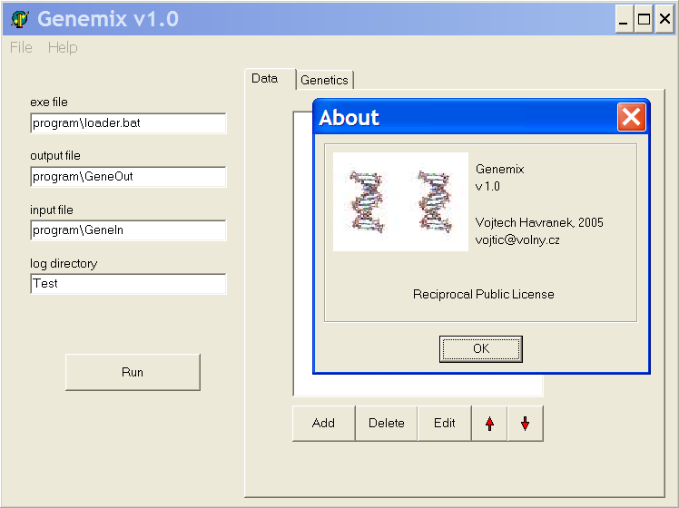

V. Havranekâ's framework for genetic optimisation of your Gomoku / Renju program (AI, engine). Together with batch running option of P. Lastovickaâ's Piskvork manager, you can use it to improve your artificial intelligence (AI, engine). Made in Pascal. Other tags: Five in a Row, Tic Tac Toe, TicTacToe, 5 in a Row, Go-Moku, Connect, Connect5, Connect6, Caro, Noughts and Crosses, AI, engine.

************************************************************************************************
                                 Readme file for Genemix v 1.0 by Vojtech Havranek
                                                  vojtic@volny.cz
************************************************************************************************

Index:

1 Introduction
2 The Algoritm
3 Using Genemix
4 The results log
5 Evaluation program interface
6 Todo and known issues
7 License

1 Introduction

Genemix is a simple framework that provides a universal interface for genetic optimalisation of almost anything (eg artificial intelligence for a game, natural language syntactic analyser, solutions of travelling salesman problem, ...). The program allows you to edit a set of attributes of the entity being optimised and the parameters of the genetics (eg the size of population, the number of epochs, etc). The optimisation is then run in the framework applying genetic modification at the values of the attributes and launching an external program that evaluates the entity's fitness for each new set of attributes' values. Due tu selection of the fittest, the process results in the attributes evolving to better values.
No particular installation is needed, just extract the files to a chosen directory.

2 The Algorithm

The genetic algorithm used in Genemix is specified by several parameters that can be modified in the framework. It works with a population of entities that differ in their attribures' values. The process of the optimisation consists of epochs. The size of the population and the numbet of epochs can be set in the framework. At the beginning of each epoch, we have a new population (for the creation of the first population, see below). For each entity of the population, the framework launches an external program(provided by the user) that evaluates the entity's fitness. The atributes' values are passed to the external program and the determined fitess is returned by text files.
Subsequently, a new population is created of the old one in accordance to the fitesses of their members. Firstly, the best n entities of the old population (the elite) are taken to the new one without any change where the parameter n can be selected by the user. The rest of the new population is completed by the tournament method: Two entities of the old population are taken by random and the one with greater fitess of them is put to the new population while the other one is discarded. We do this two times and then, with a probability that can be set by the user, we apply a "Crossover" on the two entities selected. This means that the two entities exchange values of half of their attributes (chosen randomly) between them. Finally, with a probability that can be specified, we apply a mutation on each member of the new population except for the elite.
If the number of epochs was sufficient, the fitness of the entities in the last population should be considerably better.

3 Using Genemix

When you run Genemix, the main window opens with four editboxes on the left, a tabbed notebook on the right and the main menu.
In the uppermost editbox on the left, you can specify the location of the external evaluation program executable. Below, you can set the path to the Genemix output file, where Genemix passes the argument values for the evaluation program, and the input file, where the evaluation program stores saves the determined fitness. In the lowest box, you set the name of the directory where Genemix will save all the results of the optimisation. Pay attention to change this setting between your experiments! You may overwrite your previous results!
The tabbed notebook consists of two tabs - Data and Genetics. On the Data tab, you describe the attributes that will be subject of the optimisation. There's a listbox with the attributes' names (initially empty) with five buttons bellow. With those buttons, you can add a new attribute, delete or edit an existing attribute or change the selected attribute's order in the list.
Clicking the add or edit button opens the attribute properties window. There, you can name the attribute and set it's
possible values, which you do by setting it's value type (integer or real), it's initial, maximal and minimal value and the step, which is the smallest change of the value possible. The radiobox Randomization determines, how the values of the first population will be created. The option None means that all the members of the first population will have the value of this attribute egal to the initial value. The option All but one means that the first member of the population's value will match the initial while the other will have a random value. The option All causes all the entities to have the value of the attribute random. This setting is very important for the effectivity of the optimalisation. If you set all the attributes  not to be random, the initial population will be uniform and will lead to very slow evolution. If you have no idea, what the target attribute values should be, you should set all the attributes to be initialised randomly. If you think that you know a very good value of some attribute, you can set the attribute's initial value to that value and the randomization to none. However, if you already have a solution with acceptable results, the best setting is to set all initial values to match that solution and all the randomizations to all but one. This (together with the elite setting) insures that the solution already found will not disapear and the other random entities will combine with that to improve the solution.
At the other tab of the notebook, Genetics, you set the parameters of the genetic algorithm. Their description comes above with the algorithm.
The main menu allows you to save and load the configuration of the attributes for reusing it. From the main menu, you can also close the framework, read the about dialog or open this Readme file.

When all the settings are finished, click the run button to start the optimisation. This will open the Evolution process window. To launch the process, click the Start button which starts executing successively the evaluation program for each entity in each population. It is possible, that you experience some problems with the framework responding slowly during the simulation, but the optimisation is running correctly. The logbook in the window shows important messages concerning the process of optimisation - the start, the end, the fitnesses of the populations and mutation notifications. You may abort the process before the end with the button at the bottom. When the simulation ends, you close the window with the same button.

4 The results log

During the optimisation process, Genemix saves information about the results to the directory specified in the log directory editbox of the main window. The content of the logbook is saved to the file progress.log. Also, a subdirectory is created for each generation of population named with the number of the population. Inside, there are two files for each entity in the generation. For the n-th entity, there is a file named <n> and member<n>. The file member<n> contains the description of the entity attributes' values beginning with line saying "This is output file of Gene genius" followed by pairs of lines containing attributes names and values. The file <n> contains almost the same information, but contains the evaluation of the entity's fitness.

5 Evaluation program interface

To use Genemix, you must make your external evaluation program that is able to read the framework's outputs and pass it's results to the framework's input file correctly. You pass the path to the program executable (or a batch file) and Genemix output and input file to the appropriate editbox in the framework's main window. Genemix then launches the program for each entity in each population during the optimisation. For example, if you are using Genemix to optimize some parameters of an artificial intelligence you created for checkers game, each time the evaluation program would be executed, it would take the parameters from the Genemix output file (eg it's agressivity) test the artificial intelligence against some fixed set of opponents and write it's fitness evaluation to the Genemix input file. The more successfull the artificial intelligence, the higher the evaluation.
The format of the Genemix output file, that your evaluation program has to read, is exactly the same as the file <n> in the log directory i.e. the line "This is output file of Gene genius" followed by pairs of lines containing attributes names and values. The format of the Genemix input, that your evaluation program has to create, is very simple with only two lines. On the first line, there should be some commentary such as "This is input file for Gene Genius" followed by a line with a single integer or real number denoting the determined fitness. The higher the fitness the better the entity.

6 Todo and known issues
	
Saving the best entity of the last epoch as a new attribute values configuration
Context help
Add more initial population creation options (randomize all but n, ...)
Try more crossover methods (average value, ...)
Changes log

7 License

This program is distributed under the terms of "Reciprocal Public License". You can get it from http://opensource.org/licenses. Here is only a short abstract of this license:

I) The Program is free. You may distribute it in any medium. There can be other programs (free or commercial) on the same medium.
II) You may modify the Program and you may incorporate parts of the Program into your programs. In both cases, you may distribute modified or derived versions only if you also meet all of these conditions:
  a) You must not remove or alter this license.
  b) You must not delete the original author's name.
  c) You write documentation of all changes and the date of any change.
  d) You will make your derived source code available via FTP or HTTP.
III) The Program is provided without warranty. 

Please let me know of any problems you encounter or any suggestions you have. The program is distributed with the source code for Borland Delphi and you're welcome to make any modification in order to make it fit your needs. However, the commentaries of the source code are in Czech language.
